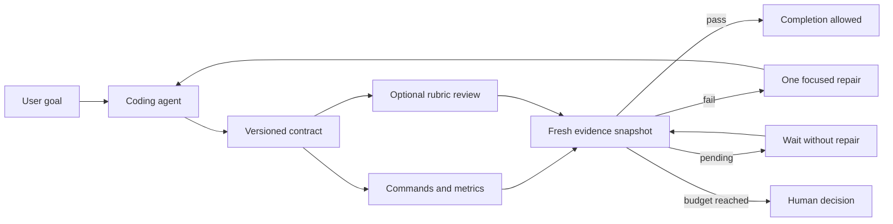
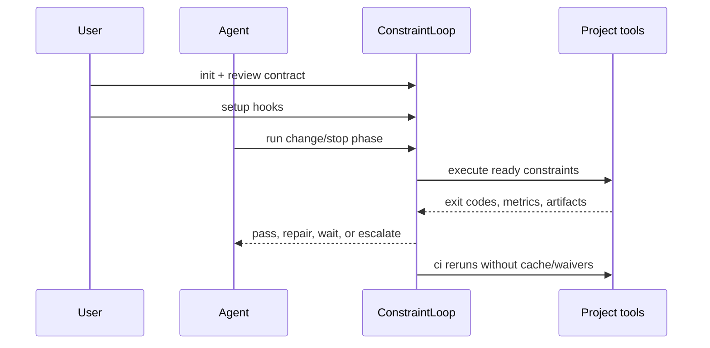

# ConstraintLoop

[](https://github.com/mauhpr/constraintloop/actions/workflows/ci.yml)
[](https://codecov.io/gh/mauhpr/constraintloop)

ConstraintLoop is an evidence-based completion gate for AI coding agents. Instead
of relying on a human to inspect every generated line, it requires the agent's
work to pass an explicit, versioned contract of tests, static checks, metrics,
artifacts, and independent model rubrics.

The central distinction is deliberate:

- **Deterministic constraints** produce reproducible evidence: exit codes,
  parsed metrics, and validated artifacts. Required deterministic failures
  block autonomous completion. A human may explicitly waive an exact local
  evidence snapshot with a non-empty reason; CI ignores every waiver and
  remains blocking.
- **Non-deterministic constraints** apply a written rubric through OpenAI,
  Anthropic, or any command that speaks ConstraintLoop's JSON protocol. They are
  advisory by default. A required rubric must run at least twice and declare a
  majority quorum.

ConstraintLoop supports Claude Code, Codex, and Gemini CLI through their hook
lifecycles. CI is the final authority: it ignores local caches and human waivers.

Bounded convergence loops are included in the v0.1 release scope. The design
keeps ConstraintLoop in control of evidence, budgets, and stopping while native
Claude or Codex loops perform at most one requested repair per transition. See
[docs/convergence-loops.md](docs/convergence-loops.md).

## At a glance

| Question | ConstraintLoop answer |
| --- | --- |
| What decides that work is complete? | Fresh evidence from a committed contract |
| What can block locally? | Required deterministic failures and undisposed advisory findings |
| What can block CI? | Every required CI constraint; local caches and waivers are ignored |
| Does it replace pytest, Ruff, or CI? | No. It turns their outputs into one completion decision |
| Does it run an autonomous agent? | No. It owns evidence and stopping; native agents own repairs |
| Can it review design? | Yes, through optional OpenAI, Anthropic, Codex, Claude Code, or command evaluators |
| Can it loop forever? | No. Every convergence loop has repair, unchanged-result, and time budgets |



## Choose your path

| I want to… | Start here |
| --- | --- |
| Add tests, coverage, and lint gates | [Quick start](#quick-start) and [task-oriented recipes](docs/recipes.md) |
| Understand when each gate runs | [Lifecycle](#lifecycle) |
| Configure every schema field | [Configuration reference](docs/configuration.md) |
| Use Codex or Claude Code for design review | [Native CLI evaluators](docs/native-cli-evaluators.md) |
| Use OpenAI or Anthropic directly | [Provider privacy](docs/provider-privacy.md) |
| Add a bounded repair or monitoring loop | [Convergence loops](docs/convergence-loops.md) |
| Diagnose a failure or stale cache | [FAQ and troubleshooting](docs/faq.md) |
| Evaluate the security boundary | [Threat model](docs/threat-model.md) |

## Quick start

```bash
python -m venv .venv
. .venv/bin/activate
pip install constraintloop

constraintloop init
constraintloop setup --adapter all
constraintloop run
constraintloop ci
```

`constraintloop init` detects existing Python and Node tooling and writes a
plain `constraintloop.yml`. It does not install tools or silently invent gates.
Review and commit the contract.

The five commands above establish this flow:



## Contract

```yaml
version: 1
settings:
  max_auto_retries: 2

constraints:
  tests:
    kind: command
    command: [python, -m, pytest, -q]
    phases: [stop, ci]
    watch: ["src/**/*.py", "tests/**/*.py", pyproject.toml]

  coverage:
    kind: metric
    command: [python, -m, pytest, --cov, "--cov-report=json:coverage.json"]
    parser:
      type: json
      source: file
      file: coverage.json
      path: totals.percent_covered
    threshold: {operator: gte, value: 85}
    needs: [tests]
    phases: [stop, ci]

  design_review:
    kind: rubric
    enforcement: advisory
    evaluator: independent_review
    rubric: >
      Fail when the patch introduces an unjustified public API, crosses an
      existing architectural boundary, or omits handling for a named failure
      case. Cite concrete files in every finding.
    include: ["src/**/*.py"]
    phases: [stop, ci]

evaluators:
  independent_review:
    type: openai
    model: YOUR_PINNED_MODEL
```

See [examples/constraintloop.full.yml](examples/constraintloop.full.yml) for all
constraint types.

The pre-release engineering and open-source checklist is tracked in
[docs/release-readiness.md](docs/release-readiness.md).
Participation is governed by the [Code of Conduct](CODE_OF_CONDUCT.md).
Maintainer release setup and Trusted Publishing invariants are documented in
[RELEASE.md](RELEASE.md).
The strict schema is documented in
[docs/configuration.md](docs/configuration.md), and remote evaluator disclosure
and cost controls are documented in
[docs/provider-privacy.md](docs/provider-privacy.md).
OpenAI request-shape, failure, SDK-compatibility, and semantic-corpus checks are
documented in [docs/openai-evaluation.md](docs/openai-evaluation.md).
Optional local Codex and Claude Code command evaluators are documented in
[docs/native-cli-evaluators.md](docs/native-cli-evaluators.md).

### OpenAI evaluator setup

Install the optional provider SDK:

```bash
uv sync --extra dev --extra openai
```

For local development, paste the key into the gitignored
`.constraintloop/secrets.env` file:

```dotenv
OPENAI_API_KEY=your-key-here
```

Process environment variables take precedence over the local file. In CI, use
the CI platform's secret store and expose `OPENAI_API_KEY`; do not create or
commit a credential file. ConstraintLoop parses the local file as plain
`KEY=VALUE` data and never evaluates it as shell code. Agent hook writes to this
file are denied.

This repository dogfoods an advisory native-agent design rubric. OpenAI and
Anthropic remain optional provider integrations. Keep probabilistic gates
advisory until their false-positive and false-negative rates are measured.

## Lifecycle

| Phase | Typical trigger | Intended work |
| --- | --- | --- |
| `change` | After a file-changing tool action | Fast syntax, formatting, or diff checks |
| `stop` | When the agent attempts to finish | Tests, build checks, and advisory review |
| `ci` | Protected hosted workflow | Authoritative uncached and waiver-free verification |

1. `SessionStart` tells the coding agent which required gates exist.
2. The prompt hook records the user's goal as review evidence.
3. Before tool execution, agent attempts to edit the contract or create a
   waiver are denied.
4. After tool execution, `change` gates run and fresh results are injected.
5. Before compaction, the completion policy is restated.
6. At `Stop` / `AfterAgent`, required `stop` gates block completion. The agent
   receives precise evidence and may repair the code a bounded number of times.
7. Advisory failures require either passing fresh evidence or an explicit
   snapshot-bound explanation; delivery alone never counts as review.
8. Repeated required failure stops autonomous repair and requests a human
   decision. A trusted human can record a reasoned, snapshot-bound local waiver;
   hooks deny observed agent waiver commands, any relevant change invalidates
   it, and CI ignores it. The local CLI cannot authenticate whether its caller
   is human.
9. `constraintloop ci` reruns every CI gate without local evidence or waivers.

Evidence is keyed by the constraint definition and the bytes of every file
matched by `watch`. A source change therefore makes old evidence and waivers
stale without a mutable invalidation list. Local state lives under the
gitignored `.constraintloop/state` directory; set `CONSTRAINTLOOP_CACHE_DIR` to
override it.

### Verdicts and what they mean

| Verdict | Meaning | Can complete? |
| --- | --- | --- |
| `pass` | Fresh evidence satisfies the constraint | Yes |
| `fail` | The tool or rubric found a concrete violation | No when required |
| `pending` | External or delayed evidence is not ready | No |
| `uncertain` | An evaluator could not produce a reliable verdict | No when required |
| `error` | ConstraintLoop could not evaluate safely | No |
| `waived` | A human accepted one exact local deterministic snapshot | Locally only; never in CI |
| `skipped` | A dependency prevented execution | Only when no required result is missing |

## Commands

- `constraintloop init` — generate a reviewable initial contract.
- `constraintloop setup --adapter claude|codex|gemini|all` — merge hook entries
  while preserving existing hooks.
- `constraintloop uninstall --adapter claude|codex|gemini|all` — remove only
  ConstraintLoop hook entries while preserving unrelated settings.
- `constraintloop run --phase change|stop` — run local gates with fresh caching.
- `constraintloop ci` — authoritative, uncached, waiver-free run.
- `constraintloop cycle NAME --json` — execute one journaled loop transition.
- `constraintloop supervise NAME` — poll pending evidence under a recoverable
  single-writer lease and exit whenever repair or termination is required.
- `constraintloop loop-prompt NAME --adapter claude|codex` — print the bounded
  native-agent repair protocol without launching an agent.
- `constraintloop status` — inspect evidence without executing commands.
- `constraintloop debug ID` — explain evidence freshness, evaluator
  configuration, executable resolution, and native CLI availability without
  running an evaluator or consuming model quota.
- `constraintloop acknowledge ID --reason "..."` — record an explicit
  snapshot-bound advisory disposition without changing its verdict.
- `constraintloop doctor` — validate and fingerprint the contract.
- `constraintloop waive ID --reason "..."` — human-local, snapshot-bound waiver
  for fresh non-passing deterministic evidence. Rubrics cannot be waived.
- `constraintloop enhance` — write a review-only proposal for stronger tooling.
- `constraintloop author` — write a review-only QA/test-authoring proposal.

`enhance` and `author` intentionally do not install dependencies or modify the
active contract in v0.1. Their proposal files make the future self-improvement
path auditable.

## Documentation

| Guide | Contents |
| --- | --- |
| [Recipes](docs/recipes.md) | Copyable Python, native-review, CI, and bounded-loop setups |
| [FAQ](docs/faq.md) | Caching, failure modes, providers, hooks, security, and troubleshooting |
| [Configuration](docs/configuration.md) | Strict schema, defaults, constraints, evaluators, and loops |
| [Convergence loops](docs/convergence-loops.md) | State machine, budgets, leases, and native-agent protocol |
| [Native evaluators](docs/native-cli-evaluators.md) | Codex and Claude Code read-only rubric execution |
| [Provider privacy](docs/provider-privacy.md) | Data flow, disclosure, credentials, cost, and failure behavior |
| [Threat model](docs/threat-model.md) | Trusted inputs, controls, residual risks, and non-goals |
| [Release readiness](docs/release-readiness.md) | Compatibility, quality, security, and publishing gates |

## Evaluator command protocol

A command evaluator receives an `EvaluationBundle` JSON object on stdin and must
write exactly one object to stdout:

```json
{
  "verdict": "pass",
  "score": 0.91,
  "rationale": "The patch satisfies the rubric.",
  "findings": []
}
```

Valid verdicts are `pass`, `fail`, and `uncertain`. Provider errors and malformed
responses become `uncertain`; a required rubric therefore fails closed.

## Compatibility boundary

The supported v0.1 surfaces are the CLI and exit codes, configuration schema,
evaluator command protocol, native hook responses, and schema-versioned
evidence and cycle JSON. Python submodules are internal during initial
development and are not covered by semantic-versioning compatibility promises.
Migration notes will accompany changes to supported schemas and protocols.

## Security model

Hooks are policy automation, not a security sandbox. A sufficiently privileged
agent process can bypass local hooks or alter local files. The trusted boundary
is a protected, reviewed contract plus an independent CI run. See
[docs/threat-model.md](docs/threat-model.md).

## Frequently asked questions

**Why not just tell the agent to run tests?** Because a prompt is not durable
policy. ConstraintLoop records which contract ran, which inputs it covered, and
whether the evidence is still fresh.

**Why do some constraints run after every action?** Put only fast feedback in
the `change` phase. Expensive tests and reviews belong in `stop` and `ci`.

**Can I use Codex or Claude Code instead of an API evaluator?** Yes. The native
evaluator adapter prefers the active supported CLI and remains read-only.

**How do I test failure behavior?** Use deterministic commands or fixtures that
return known failure, pending, malformed, timeout, or corruption outcomes. Do
not spend provider quota merely to manufacture an error.

See the complete [FAQ and troubleshooting guide](docs/faq.md).

License: MIT.
