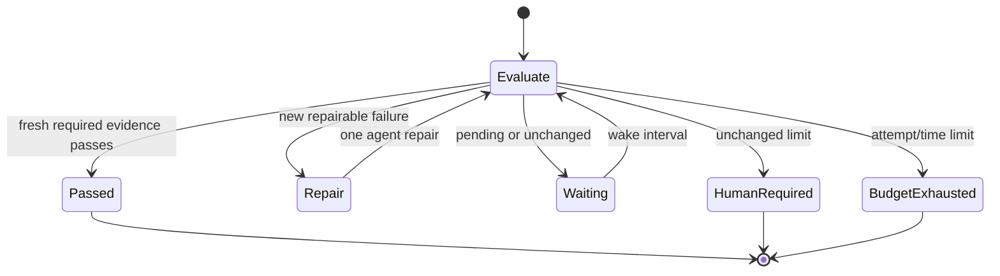

# Task-oriented recipes

These recipes start small and keep expensive work at session or CI boundaries.
Every referenced contract is parsed by the test suite, so examples cannot drift
silently from the strict schema.

## Pick phases by feedback cost

| Check | Recommended phase | Why |
| --- | --- | --- |
| Diff whitespace, syntax, targeted formatter | `change` | Fast enough to run after edits |
| Unit tests, type checking, package build | `stop`, `ci` | Useful before completion, but noisy after every action |
| Full integration or platform suite | `ci` | Hosted dependencies and longer runtime |
| Design/security rubric | `stop`, optionally `ci` | Needs a complete patch and bounded evidence bundle |
| Deployment or review status | `stop`, `ci` with pending code | External state may need polling |

A constraint can belong to more than one phase. The `watch` globs determine
when cached local evidence becomes stale.

## Python project: tests and coverage

Start from [examples/recipes/python-quality.yml](../examples/recipes/python-quality.yml):

```bash
cp examples/recipes/python-quality.yml constraintloop.yml
constraintloop doctor
constraintloop run --phase stop
constraintloop ci
```

The example separates fast syntax checking from session-end tests and coverage.
Coverage depends on tests, so a test failure prevents a redundant coverage run.

## Native Codex or Claude Code review

[examples/recipes/native-review.yml](../examples/recipes/native-review.yml)
adds an advisory design review after deterministic tests:

```bash
constraintloop debug design_review
constraintloop run --phase stop --no-cache
```

The adapter selects an available supported native CLI. The evaluator receives a
bounded evidence bundle, runs without repair tools, and must return the strict
verdict protocol. If the review fails or is uncertain, either address it and
rerun fresh evidence or record an exact disposition:

```bash
constraintloop acknowledge design_review \
  --reason "The finding applies only to an intentionally unsupported platform."
```

Acknowledgment does not turn the verdict into a pass and becomes stale when the
review input or finding changes.

## OpenAI or Anthropic review

Replace the command evaluator in the native-review recipe with one provider:

```yaml
evaluators:
  independent_review:
    type: openai
    model: YOUR_PINNED_MODEL
    timeout_seconds: 60
    max_attempts: 2
    max_output_tokens: 2000
    reasoning_effort: minimal
```

Install the matching optional extra and keep the key outside the repository:

```bash
uv sync --extra openai
mkdir -p .constraintloop
chmod 700 .constraintloop
```

Write `OPENAI_API_KEY=...` into the gitignored
`.constraintloop/secrets.env` using your preferred secret-safe editor. Do not
paste credentials into agent prompts or command output. Review
[provider data flow and privacy](provider-privacy.md) before enabling a remote
evaluator.

## Bounded completion loop

[examples/recipes/bounded-completion.yml](../examples/recipes/bounded-completion.yml)
allows at most three repair transitions and stops after 20 minutes:

```bash
constraintloop cycle completion --json
constraintloop loop-prompt completion --adapter codex
constraintloop supervise completion
```



`cycle` performs one transition and never sleeps. `supervise` polls under a
single-writer lease but exits when a repair or human action is required. Neither
command launches an agent.

## Delayed external evidence

Make a status command return:

- `0` when the external check passes;
- `1` (or another normal failure code) for a completed failure;
- `75` while the result is still pending.

```yaml
constraints:
  deployment:
    kind: command
    command: [scripts/deployment-status]
    success_codes: [0]
    pending_codes: [75]
    phases: [stop, ci]
    watch: [scripts/deployment-status]
```

Pending evidence never passes and never consumes a repair attempt. Repeated
unchanged polling also does not invoke a model.

## CI as final authority

Local hooks optimize feedback; CI makes the trusted decision:

```bash
constraintloop ci
```

CI ignores local caches and waivers. Keep API-backed rubrics advisory unless
fork policy, credentials, costs, and false verdicts are explicitly managed.
Deterministic required gates should remain the release authority.

## Debug without provider quota

Use `debug` before rerunning an evaluator:

```bash
constraintloop debug design_review
constraintloop status
```

Debug reports contract identity, evidence freshness, executable resolution, and
native CLI availability. It does not call the evaluator or consume model quota.

For common symptoms and decisions, continue with the
[FAQ and troubleshooting guide](faq.md).
